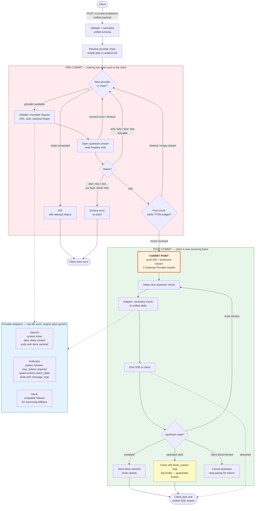

# Model Router Gateway — Architecture

Single living diagram. Update this as the design changes.

## Why the commit point exists

Silent fallback and zero buffering are in tension. The resolution is ordering: a
429/502/503 arrives in the upstream status line, which lands before any body bytes and
before we have produced our own status line. So we can abandon a provider and try the
next one while the client has seen nothing at all.

We hold back exactly one chunk to confirm the stream is genuinely alive — one chunk,
never the full payload.

## Invariants

- Provider selection completes **before** the streaming response object is constructed.
  The framework sends headers before iterating the response generator, so lazy selection
  inside the generator would leak a premature 200 and make silent fallback impossible.
- The upstream connection stays open **inside** the generator that feeds the response.
  Closing it during selection and reopening later is the classic bug in this pattern.
- Read timeout is effectively unbounded (token gaps are normal); a separate short
  time-to-first-byte budget exists solely to trigger fallback on a stalled-but-connected
  upstream.
- Every fallback is logged with the full attempt chain, and the serving provider is
  echoed in a response header. A gateway that hides failures from clients must not hide
  them from operators.
- The fallback engine never knows which provider it is talking to. Adding a provider is
  one new adapter file plus a routing table entry.

## Delivery plan

Ordered by risk retired, not by architectural tidiness. Every slice ends in a running,
committable state. If the clock runs out mid-plan, the last commit is still a working
product.

### MVP — the demo stands on its own after slice 6

Slices 1–3 are committed and verified live against a local Ollama server
(`qwen2.5:0.5b`) via `OPENAI_BASE_URL=http://127.0.0.1:11434/v1`: non-streaming, SSE
streaming, and upstream error passthrough all confirmed.

- [x] **1. Strip the scaffold, add gateway config.** Remove the `items` demo, extend
      settings with provider keys, base URLs, and timeout policy. Mount the API at `/v1`.
      *Done when:* server boots, `/health` responds.
      *Commit:* `chore: strip demo scaffold, add gateway configuration`

- [x] **2. Unified schema, one provider, non-streaming.** `POST /v1/chat/completions`
      with `stream=false`, hardcoded to a single upstream. No adapter abstraction, no
      fallback. The thinnest possible vertical slice.
      *Done when:* a curl returns a real completion.
      *Commit:* `feat: unified chat completions endpoint over a single upstream`

- [x] **3. Streaming relay.** Same endpoint with `stream=true`, SSE out, nothing
      buffered. Still one provider, still no fallback.
      *Done when:* `curl -N` shows tokens arriving progressively.
      *Commit:* `feat: SSE streaming relay`
      *Retires the risk of:* generator lifetime and premature header flush.

- [ ] **4. Adapter seam plus mock provider.** Extract the provider interface; add a mock
      provider with injectable failures. Pure refactor, no new user-facing behaviour.
      *Done when:* config can point a model at the mock and get fake tokens.
      *Commit:* `refactor: extract provider adapter interface, add mock provider`

- [ ] **5. Routing table.** Model alias resolves to an ordered provider chain. Chains may
      still be length one.
      *Done when:* two aliases demonstrably reach different providers.
      *Commit:* `feat: model routing table`

- [ ] **6. Silent fallback, pre-commit.** The attempt loop and commit point. Driven by
      the mock's injectable 429/503. This is the core deliverable.
      *Done when:* primary is forced to 429 and the client still receives one clean,
      uninterrupted stream from the backup.
      *Commit:* `feat: silent pre-commit fallback across provider chain`

### Hardening — each is independently shippable

- [ ] **7. Error taxonomy and timeouts.** Retryable versus terminal classification,
      chain-exhausted 503 with attempt history, time-to-first-byte budget.
      *Commit:* `feat: error classification and timeout policy`

- [ ] **8. Second real adapter.** Anthropic, proving the seam is real rather than
      decorative.
      *Commit:* `feat: anthropic provider adapter`

- [ ] **9. Post-commit failures and cancellation.** Mid-stream upstream death, and
      cancelling the upstream when the client disconnects so we stop paying for tokens.
      *Commit:* `feat: mid-stream failure handling and upstream cancellation`

- [ ] **10. Observability.** `X-Gateway-Provider` response header, structured per-request
      attempt logs.
      *Commit:* `feat: fallback observability`

### Working defaults

Assumed so work can start without further decisions. Each is cheap to reverse.

| Question | Default |
| --- | --- |
| Backup may differ from primary how? | Same model, different host where possible |
| Unsupported parameter | Reject with a clear error, never silently drop |
| Client visibility | Silent in-stream, serving provider exposed in a header |
| Post-commit failure | Close cleanly, log loudly |
| Routing config | `routing.yaml` |
| Auth and rate limiting | Out of scope for v1 |
