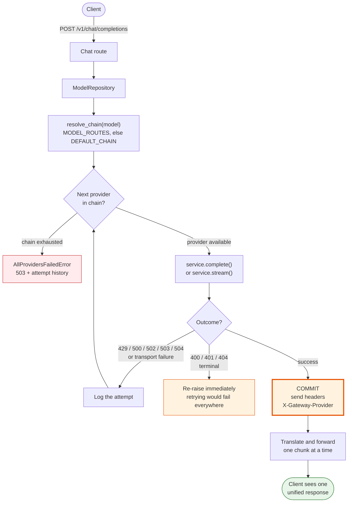
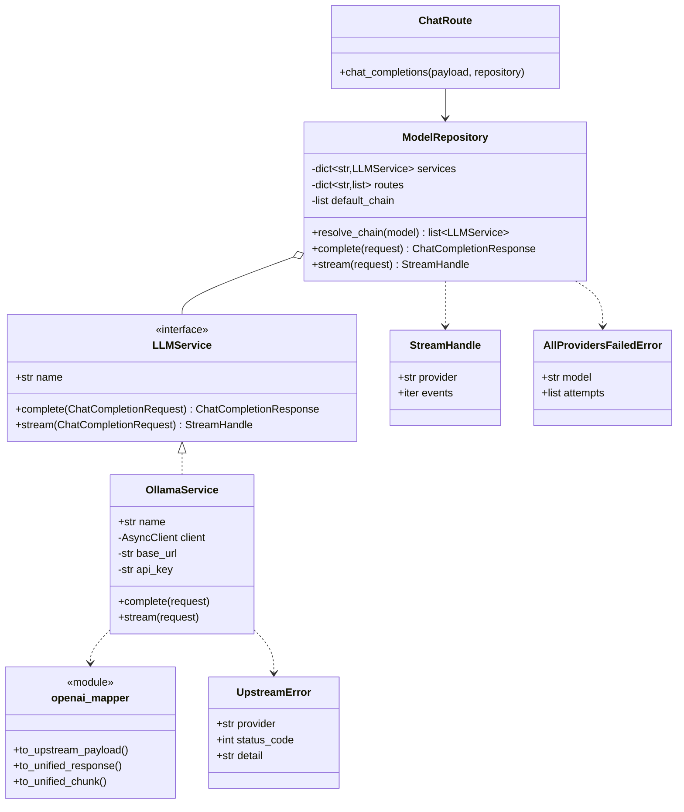

# model-router-gateway

An API gateway that acts as a unified model router. It accepts one standardized inference
schema, translates it for real LLM providers, streams responses back over SSE without
buffering, and silently falls back to a backup provider when a primary fails.

## How a request flows



The commit point is the important part. A 429 or 503 arrives in the upstream's status
line, before any body bytes and before we have written our own response headers, so the
gateway can abandon that provider and try the next one while the client has seen nothing.
Once headers go out we are committed, and only one chunk is ever held back to confirm the
stream is alive — never the full payload.

## How the pieces fit



The route knows only the repository. The repository knows only the interface, so it never
learns which provider it is calling — it reads a status code and decides whether to move
on. Each service owns its own auth scheme and its own schema translation.

Adding a provider means writing one service and registering its name and base URL. For an
OpenAI-compatible upstream it can reuse `openai_mapper` wholesale; a provider with a
different wire format brings its own mapper.

## Requirements

- Python 3.11+ (developed against 3.14)

## Setup

```bash
python3 -m venv .venv
source .venv/bin/activate
pip install -r requirements-dev.txt   # use requirements.txt for production
cp .env.example .env
```

## Run

```bash
uvicorn app.main:app --reload
```

| Resource | URL |
| --- | --- |
| Health | http://127.0.0.1:8000/v1/health |
| Chat completions | http://127.0.0.1:8000/v1/chat/completions |
| Swagger UI | http://127.0.0.1:8000/docs |
| OpenAPI schema | http://127.0.0.1:8000/openapi.json |

## Usage

Non-streaming:

```bash
curl -s http://127.0.0.1:8000/v1/chat/completions \
  -H 'Content-Type: application/json' \
  -d '{"model":"qwen2.5:0.5b","messages":[{"role":"user","content":"hello"}]}'
```

Streaming over SSE — `-N` disables curl's own buffering so you can watch tokens arrive:

```bash
curl -N http://127.0.0.1:8000/v1/chat/completions \
  -H 'Content-Type: application/json' \
  -d '{"model":"qwen2.5:0.5b","messages":[{"role":"user","content":"hello"}],"stream":true}'
```

The response carries `X-Gateway-Provider`, naming the provider that actually served it
after any fallback.

## Configuration

Providers are registered by name, and chains are ordered lists where the first entry is
the primary.

```bash
PROVIDERS={"ollama":"http://127.0.0.1:11434/v1","openai":"https://api.openai.com/v1"}
PROVIDER_API_KEYS={"openai":"sk-..."}
DEFAULT_CHAIN=["ollama","openai"]
MODEL_ROUTES={"gpt-4o-mini":["openai","ollama"]}
```

A model with no explicit route uses `DEFAULT_CHAIN`. Providers without an API key send no
authorization header, which is what a local Ollama expects.

## Failure handling

| Upstream result | Gateway behaviour |
| --- | --- |
| 429, 500, 502, 503, 504 | Transient — try the next provider silently |
| Connection refused or timeout | Transient — try the next provider silently |
| 400, 401, 403, 404 | Terminal — surfaced immediately, never retried |
| Whole chain failed | 503 `all_providers_failed` listing every attempt |

Terminal errors are not retried because a malformed request or a bad key fails identically
everywhere; retrying only multiplies latency and hides the real fault.

## Timeout policy

Streaming upstreams get no read timeout, because long gaps between tokens are normal. A
stalled-but-connected upstream is caught instead by a separate first-chunk budget
(`UPSTREAM_FIRST_CHUNK_TIMEOUT_SECONDS`).

## Layout

```
app/
  main.py                     app factory, lifespan, provider registration
  core/config.py              pydantic-settings configuration (env-driven)
  core/errors.py              error types and transient/terminal classification
  api/
    router.py                 aggregates routers
    deps.py                   typed dependency aliases
    routes/                   health.py, chat.py
  schemas/chat.py             unified request/response/chunk models
  services/
    model_repository.py       chain resolution and the fallback loop
    llm/base.py               LLMService protocol and StreamHandle
    llm/ollama.py             OpenAI-compatible provider service
    llm/openai_mapper.py      schema translation to and from the unified models
mock_provider/                standalone fake providers for local experimentation
```

## Notes

- Configuration is read from environment variables or `.env`; field names map to uppercase
  env keys (`api_prefix` -> `API_PREFIX`), and dict or list fields are parsed as JSON.
- The shared `httpx.AsyncClient` is created once per process in `lifespan`, so handlers
  never construct per-request clients.
