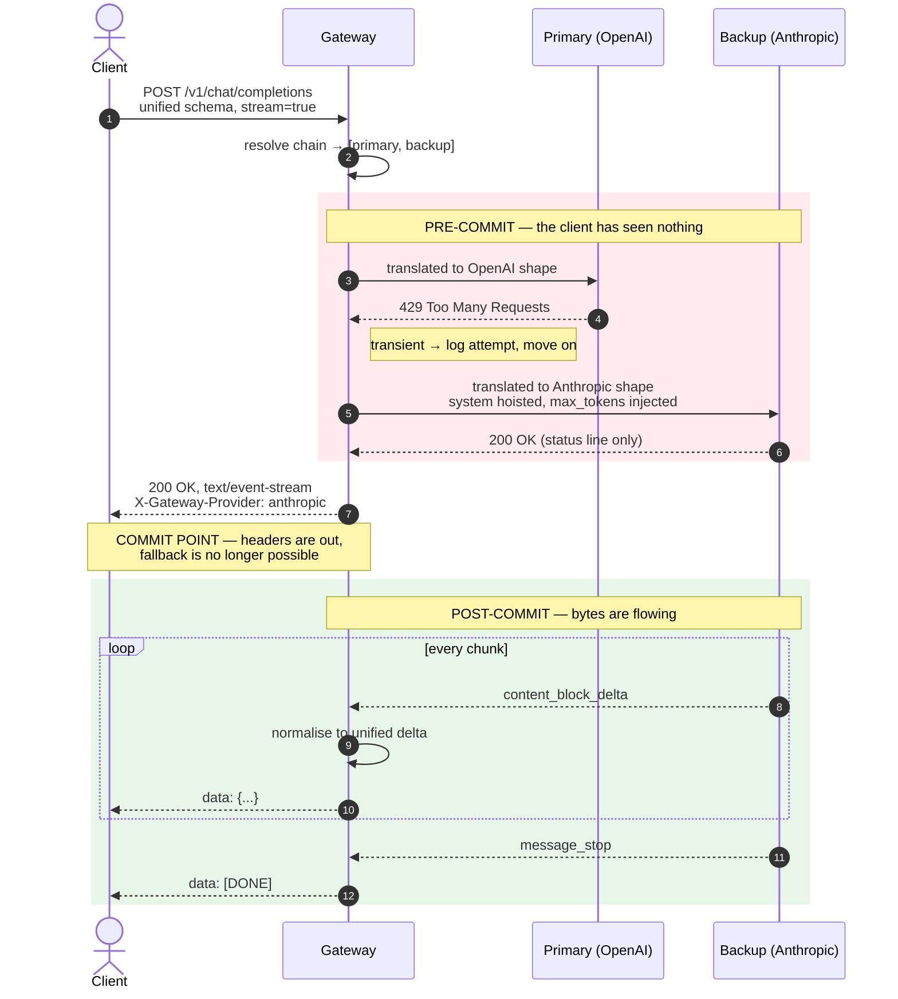
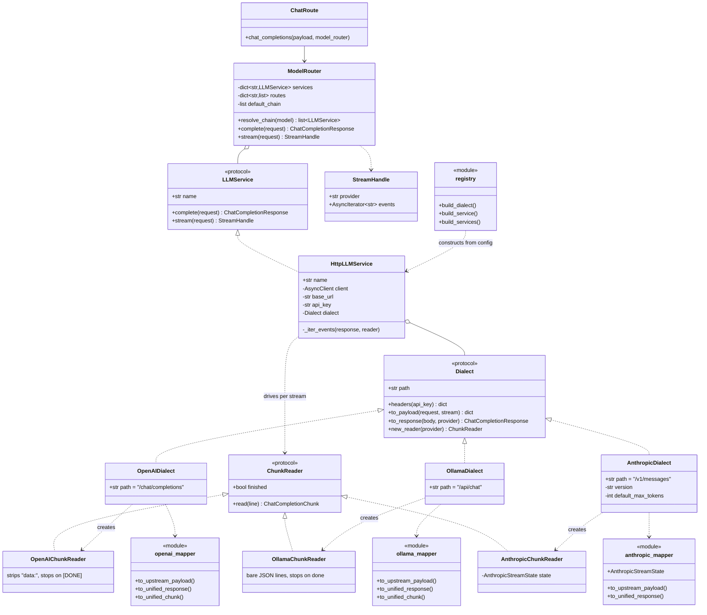

# model-router-gateway

A unified model router. It exposes one standardized inference API, translates each request
into whatever dialect the chosen provider speaks, relays the response back as it arrives,
and silently switches to a backup provider when a primary fails.

## What it does

### 1. Unified API and schema translation

One endpoint, `POST /v1/chat/completions`, accepts a single request shape regardless of
which provider ultimately serves it. Each provider gets its own adapter, so the routing
engine never learns who it is talking to.

| Provider | Endpoint | Wire format | Notable translation |
| --- | --- | --- | --- |
| OpenAI | `/v1/chat/completions` | SSE, `data:` frames, `[DONE]` sentinel | Passthrough — the unified schema is modelled on it |
| Ollama | `/api/chat` | Newline-delimited JSON, no SSE framing | Bare JSON lines reassembled into unified chunks; `done: true` becomes `finish_reason` |
| Anthropic | `/v1/messages` | SSE with typed events, `message_stop` | System message hoisted out of `messages`, `max_tokens` injected, `content_block_delta` events flattened into deltas |

Adding a provider means one dialect plus one mapper. The HTTP transport is shared, so no
new request, retry, or stream-teardown code is written per provider.

### 2. Streaming proxy over SSE

Responses stream back as Server-Sent Events with no buffering of the full payload. Chunks
are translated and forwarded one at a time, so the first token reaches the client while
the provider is still generating the rest, and memory per request stays flat regardless of
response length.

### 3. Resilient fallback routing

A model alias resolves to an ordered chain of providers. When a provider fails with a
transient error, the gateway moves to the next one and the client sees a single
uninterrupted response — no error, no reconnect, no duplicated tokens.

This works because of the **commit point**. A 429 or 503 arrives in the upstream's status
line, before any body bytes and before the gateway has written its own response headers.
At that moment nothing has reached the client, so the gateway can abandon that provider
freely. Once headers go out, the gateway is committed and no further fallback is possible.

## Architecture

A streaming request that survives a rate-limited primary:



Nothing is buffered: each chunk is translated and forwarded as it arrives. The client sees
one clean stream and never learns that the primary refused.

The route knows only the router. The router knows only the `LLMService` interface, so it
reads a status code and decides whether to move on, without ever learning which provider
it called. Below that interface, one shared transport carries every request and a
per-provider dialect supplies the auth scheme and the schema translation.

### The adapter seam



There are two seams, and the split is what keeps provider count from multiplying transport
code.

`LLMService` plus `StreamHandle` is the outer seam. Everything above it speaks the unified
schema, and the router reads only a status code and a name.

`Dialect` plus `ChunkReader` is the inner seam. `HttpLLMService` is the single
implementation of `LLMService`: it builds the URL, merges headers, posts, checks the
status, and runs the relay loop that closes the upstream response in a `finally`. It never
knows which provider it is holding. The dialect contributes only the pure per-provider
parts — a path, headers, payload and response translation, and a fresh reader per stream —
which is why the three providers now share one copy of the transport instead of three near
identical ones.

`ChunkReader` exists because parsing a stream is stateful in a way payload translation is
not. It answers two questions per line: what unified chunk does this become, and is the
stream over. `AnthropicStreamState` is the sharpest case — a `content_block_delta` only
makes sense relative to the `message_start` before it — but even OpenAI needs to recognise
its `[DONE]` sentinel and Ollama its `done: true` flag, and those terminators are exactly
what the shared loop must not hardcode.

## Requirements

- Python 3.11+ (developed against 3.14)

## Setup

```bash
python3 -m venv .venv
source .venv/bin/activate
pip install -r requirements-dev.txt   # use requirements.txt for production
cp .env.example .env
```

## Run

```bash
uvicorn app.main:app --reload
```

| Resource | URL |
| --- | --- |
| Health | http://127.0.0.1:8000/v1/health |
| Chat completions | http://127.0.0.1:8000/v1/chat/completions |
| Swagger UI | http://127.0.0.1:8000/docs |
| OpenAPI schema | http://127.0.0.1:8000/openapi.json |

## Usage

Non-streaming:

```bash
curl -s http://127.0.0.1:8000/v1/chat/completions \
  -H 'Content-Type: application/json' \
  -d '{"model":"qwen2.5:0.5b","messages":[{"role":"user","content":"hello"}]}'
```

Streaming over SSE — `-N` disables curl's own buffering so you can watch tokens arrive:

```bash
curl -N http://127.0.0.1:8000/v1/chat/completions \
  -H 'Content-Type: application/json' \
  -d '{"model":"qwen2.5:0.5b","messages":[{"role":"user","content":"hello"}],"stream":true}'
```

The response carries `X-Gateway-Provider`, naming the provider that actually served it
after any fallback.

## Configuration

Providers are registered by name, and chains are ordered lists where the first entry is
the primary.

```bash
PROVIDERS={"ollama":"http://127.0.0.1:11434/v1","openai":"https://api.openai.com/v1"}
PROVIDER_API_KEYS={"openai":"sk-..."}
DEFAULT_CHAIN=["ollama","openai"]
MODEL_ROUTES={"gpt-4o-mini":["openai","ollama"]}
```

A model with no explicit route uses `DEFAULT_CHAIN`. Providers without an API key send no
authorization header, which is what a local Ollama expects.

## Failure handling

| Upstream result | Gateway behaviour |
| --- | --- |
| 429, 500, 502, 503, 504 | Transient — try the next provider silently |
| Connection refused or timeout | Transient — try the next provider silently |
| 400, 401, 403, 404 | Terminal — surfaced immediately, never retried |
| Whole chain failed | 503 `all_providers_failed` listing every attempt |

Terminal errors are not retried because a malformed request or a bad key fails identically
everywhere; retrying only multiplies latency and hides the real fault.

Every fallback is logged with the provider, status code, and detail. A gateway that hides
failures from clients must not hide them from operators.

## Stream and connection management

### Timeout strategy

| Phase | Budget | Reasoning |
| --- | --- | --- |
| Connect | `UPSTREAM_CONNECT_TIMEOUT_SECONDS` (5s) | A provider that cannot be reached should be abandoned quickly; this is a transient failure and triggers fallback. |
| Write | `UPSTREAM_WRITE_TIMEOUT_SECONDS` (30s) | Request bodies are small; a stall here means a sick connection. |
| Read | None | Deliberate. Gaps of many seconds between tokens are normal for a healthy model, so any read timeout short enough to be useful would kill working streams. |

**Accepted limitation.** Because there is no read timeout, a provider that accepts the
request, returns `200 OK`, and then sends nothing will hang the request rather than
falling back. Fallback triggers on providers that *fail*, not on providers that *stall*.
Distinguishing a stalled upstream from a slow one requires a separate time-to-first-token
budget, measured after the status line but before the commit point. This is not currently
implemented; `UPSTREAM_FIRST_CHUNK_TIMEOUT_SECONDS` is reserved for it.

### Partial streams

If an upstream dies after the commit point, no failover is possible — the client already
holds part of the answer, and the `200 OK` cannot be retracted. This is the unavoidable
cost of not buffering: recoverability was traded for first-token latency and flat memory
use.

The gateway must not close the stream as though it finished normally. A truncated answer
carrying `finish_reason: "stop"` is indistinguishable from a complete one, so the client's
code cannot tell that content was lost — it would silently accept half a summary, or
unparseable JSON, as the whole answer.

The intended behaviour is therefore to emit a final chunk carrying an error object with
`finish_reason: "error"` and then close, leaving the client free to retry at its own level.
This is not yet implemented; a mid-stream upstream failure currently propagates out of the
relay generator and drops the connection.

### Client disconnection mid-generation

When a client hangs up, the ASGI server cancels the response task, which closes the relay
generator. `HttpLLMService._iter_events` closes the upstream response in a `finally`
block, so the upstream connection is released rather than left to run to completion. Since
there is one relay loop rather than one per provider, this holds for every dialect by
construction instead of by repetition. This
matters commercially as much as technically: an abandoned stream that keeps reading is a
stream that keeps billing for tokens nobody will ever see.

## Testing

```bash
pytest
```

Four layers:

- **Unit** (`tests/unit/`) — `HttpLLMService` alone, driven by a stub dialect over a mocked
  transport. No app, no real provider format, so these fail only when the shared transport
  itself breaks. CI runs them as their own step.
- **Integration** — the app in-process with mocked transports, covering schema translation
  for all three dialects, silent fallback, terminal errors, and chain exhaustion.
- **Cross-format fallback** — falling back from one wire format to another, which proves
  the adapter seam is real rather than decorative.
- **End-to-end** (`tests/e2e/`) — the gateway over real sockets, asserting that tokens
  arrive progressively rather than in one flush, and that a dead primary is survived.

`mock_provider/` holds standalone fake providers, one per dialect, that can be run
independently for manual experimentation. Behaviour is selected by model name — `mock/ok`,
`mock/429`, `mock/500` — so failure paths are reachable through configuration alone.

```bash
uvicorn mock_provider.openai:app    --port 8001
uvicorn mock_provider.ollama:app    --port 8002
uvicorn mock_provider.anthropic:app --port 8003
```

## Layout

```
app/
  main.py                     app factory, lifespan, provider registration
  core/config.py              pydantic-settings configuration (env-driven)
  core/errors.py              error types and transient/terminal classification
  api/
    router.py                 aggregates routers
    deps.py                   typed dependency aliases
    routes/                   health.py, chat.py
  schemas/chat.py             unified request/response/chunk models
  services/
    model_router.py           chain resolution and the fallback loop
    llm/base.py               LLMService, Dialect and ChunkReader protocols, StreamHandle
    llm/http_service.py       the one HTTP transport, shared by every provider
    llm/registry.py           builds dialects and services from configuration
    llm/openai.py             OpenAI dialect and chunk reader
    llm/ollama.py             Ollama dialect and chunk reader (native /api/chat, NDJSON)
    llm/anthropic.py          Anthropic dialect and chunk reader (/v1/messages, typed events)
    llm/*_mapper.py           per-dialect schema translation to and from the unified models
mock_provider/                standalone fake providers, one per dialect
tests/                        in-process suites, plus unit/ and e2e/ over real sockets
```

## Notes

- Configuration is read from environment variables or `.env`; field names map to uppercase
  env keys (`api_prefix` -> `API_PREFIX`), and dict or list fields are parsed as JSON.
- The shared `httpx.AsyncClient` is created once per process in `lifespan`, so handlers
  never construct per-request clients.
