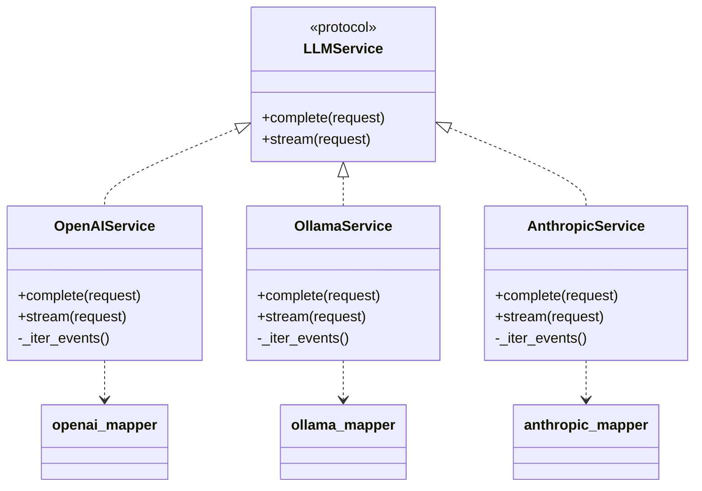
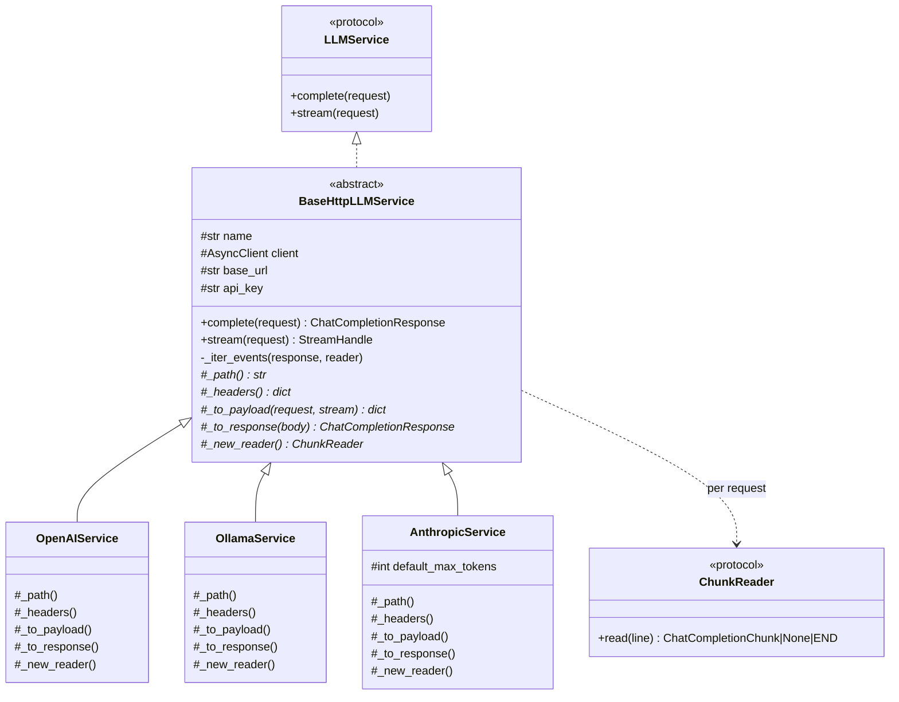
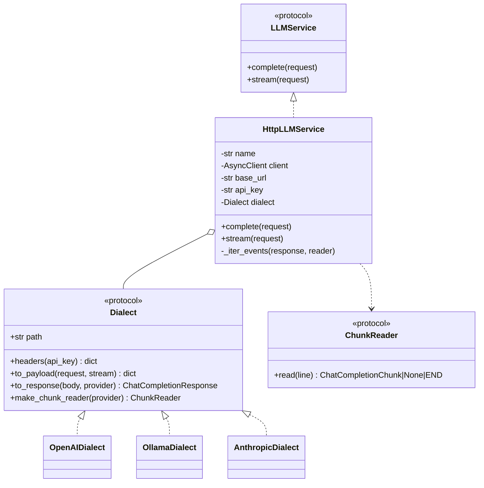

# Alternative adapter designs

Three providers currently duplicate their HTTP transport. Two ways to remove that, one
inheritance-based and one composition-based.

## Today

Three services, each implementing `LLMService`, each carrying its own copy of the HTTP
transport logic and delegating translation to a sibling mapper module.



Transport is written three times. Translation is written three times, which is correct —
those formats genuinely differ.

## Option A — Template Method (inheritance)

A base class owns the transport. Subclasses override five small hooks. One file per
provider is preserved, so a provider's behaviour still reads top to bottom in one place.



The shared `stream()` becomes the only place transport lives:

```python
class BaseHttpLLMService:
    async def stream(self, request: ChatCompletionRequest) -> StreamHandle:
        upstream = self._client.build_request(
            "POST",
            f"{self._base_url}{self._path()}",
            json=self._to_payload(request, stream=True),
            headers=self._headers(),
        )
        response = await self._client.send(upstream, stream=True)
        if response.status_code >= 400:
            await response.aread()
            detail = response.text
            await response.aclose()
            raise UpstreamError(self.name, response.status_code, detail)
        return StreamHandle(self.name, self._iter_events(response, self._new_reader()))
```

And a provider shrinks to its differences:

```python
class AnthropicService(BaseHttpLLMService):
    def _path(self) -> str:
        return "/v1/messages"

    def _headers(self) -> dict[str, str]:
        headers = {"anthropic-version": self._version}
        if self._api_key:
            headers["x-api-key"] = self._api_key
        return headers

    def _new_reader(self) -> ChunkReader:
        return AnthropicEventReader(self.name)
```

## Option B — Composition (dialect objects)

Transport and translation become separate objects. One concrete service, three dialects.



## Why both need `ChunkReader`

A single service instance serves concurrent requests, so Anthropic's streaming state — a
`content_block_delta` only makes sense relative to the `message_start` before it — cannot
live on `self`. Two simultaneous streams would corrupt each other. The state must be
created per request, which means a small object either way. Inheritance does not avoid it.

## Comparison

| | Today | Option A (inheritance) | Option B (composition) |
| --- | --- | --- | --- |
| Transport copies | Three | One | One |
| `LLMService` implementations | Three | One base, three subclasses | One |
| New provider costs | Service + mapper | Subclass + reader | Dialect + reader |
| Reading one provider end to end | One file | One file plus the base | Three files |
| Varying transport and dialect independently | No | No | Yes |
| Moving parts | Fewest | Few | Most |

## Recommendation

Option A. It removes the same duplication for less machinery and keeps one file per
provider, which is the property that makes this codebase easy to follow. Option B only
earns its extra indirection when transport and dialect need to vary independently — a
second transport, or one dialect served over two protocols — and neither is on the horizon.

The strongest argument for doing either is not the roughly one hundred lines saved. It is
that a transport concern currently has to be added three times, identically. The
first-chunk budget is exactly that change, so it is worth doing this refactor immediately
before implementing it rather than immediately after.
